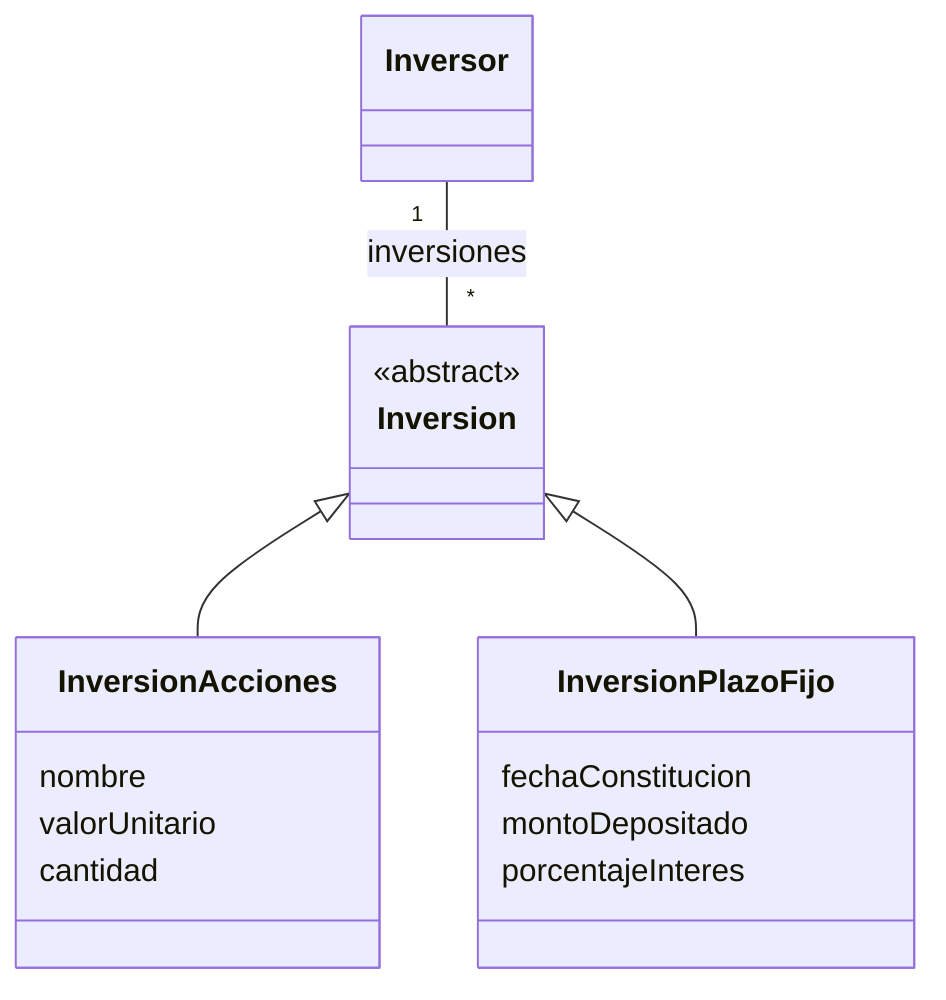

Ejercicio 3: Inversores

Estamos desarrollando una aplicación móvil para que un inversor pueda conocer el estado de sus inversiones. El sistema permite manejar dos tipos de inversiones: Inversión en acciones e inversión en plazo fijo. En todo momento, se desea poder conocer el valor actual de cada inversión y de las inversiones realizadas por el inversor.
 
Para las inversiones en acciones el valor actual se calcula multiplicando el valor unitario de una acción por la cantidad de acciones que se posee. De las acciones se conoce el nombre que las identifica en el mercado de valores, un inversor puede invertir en diferentes acciones con diferentes valores unitarios. Por su parte, para los plazo fijos, el valor actual consiste en el cálculo del valor inicial de constitución del plazo fijos sumando los intereses diarios desde la fecha de constitución hasta hoy. 
 
De las inversiones en acciones es importante poder conocer su nombre, la cantidad de acciones en las que se invertirá y el valor unitario de cada acción. Por su parte, los plazos fijos se constituyen en una fecha, es importante conocer el monto depositado y cuál es el porcentaje de interés que genera. 
 
Por último, el valor de inversión actual de un inversor es la suma de los valores actuales de todas las inversiones que posee. Un inversor puede agregar y sacar inversiones de su cartera de inversiones cuando lo desee. Las inversiones pueden ser tanto en acciones como en plazo fijos y pueden estar mezcladas. 

## Conceptos candidatos

| Tipo 	| Nombre	|
|-|-|
|	C	|	Inversor	|
|	C	|	Inversión	|
|	C	|	Inversión en acciones	|
|	C	|	Inversión en plazo fijo	|
|	C	|	~~Mercado de valores~~ → descartado (no participa en el modelo)	|
|	C	|	~~Cartera de inversiones~~ → descartado (se modela como asociación)	|
|	A	|	nombre (de la acción)	|
|	A	|	cantidad (de acciones)	|
|	A	|	valorUnitario	|
|	A	|	fechaConstitucion	|
|	A	|	montoDepositado	|
|	A	|	porcentajeInteres	|
|	A	|	~~valorActual~~ → descartado (atributo calculado, no almacenado)	|
|	A	|	~~valorActualInversor~~ → descartado (calculado como suma de inversiones)	|

## Diagrama UML

