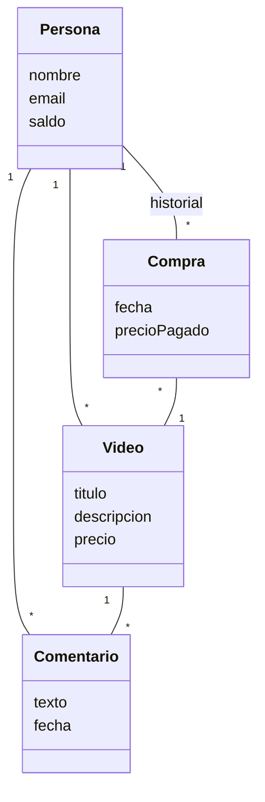

## Ejercicio 4: Videos musicales

Se desea desarrollar una plataforma dedicada a la compra y venta de videos musicales. Las personas podrán publicar sus propios videos y adquirir aquellos compartidos por otros miembros de la comunidad.

De cada persona se conoce su nombre, una dirección de correo electrónico que la identifica y un saldo de créditos. Además, puede tener videos musicales puestos a la venta. Cada vez que otra persona compra uno de sus videos, recibe un ingreso que se suma automáticamente a su saldo de créditos, el cual luego puede utilizar para realizar sus propias compras dentro de la plataforma.

Los videos disponibles en la plataforma se describen mediante un título, una breve descripción, comentarios y un precio expresado en créditos. Cada comentario incluye un texto, la persona que lo escribió y la fecha en que fue realizado. Cada vez que una persona compra un video, se descuentan créditos de su saldo, estos se transfieren al autor del contenido, y el video adquirido se registra en su historial junto con la fecha de compra.

Se debe permitir que una persona recargue créditos en su cuenta, actualizando así su saldo disponible. También debe permitir comprar un video, siempre que la persona cuente con créditos suficientes. Si la compra se concreta, se descuentan los créditos correspondientes de su saldo, se acreditan al autor del video y el video se incorpora a su historial, junto con la fecha de compra y el precio pagado en créditos. Si la persona no tiene créditos suficientes, la compra no se realiza.

Deberá permitir calcular cuántos créditos gastó una persona desde una fecha determinada. Para ello, se deberán considerar las compras realizadas a partir de esa fecha y sumar el precio pagado en cada una.

La persona que publicó un video podrá modificar su precio. Este cambio sólo afectará a las compras futuras y no deberá alterar el precio registrado en las compras realizadas con anterioridad.
Finalmente, cualquier persona podrá agregar un comentario a un video. De cada comentario se registrará el texto, la persona que lo escribió y la fecha en que fue realizado.
Tareas:

Realice la lista de conceptos candidatos utilizando las estrategias vistas en teoría (categorías de clases conceptuales e identificación de frases nominales)
Grafique el modelo de dominio usando UML.
Actualice el modelo de dominio incorporando los atributos a los conceptos
Agregue las asociaciones entre conceptos, indicando la navegabilidad, cardinalidad, nombres de rol, según sea necesario. 

## Conceptos candidatos

| Tipo 	| Nombre	|
|-|-|
|	C	|	Persona	|
|	A	|	nombre	|
|	A	|	email	|
|	A	|	saldo	|
|	C	|	Video	|
|	A	|	titulo	|
|	A	|	descripcion	|
|	A	|	precio	|
|	C	|	Compra	|
|	A	|	precioPagado	|
|	A	|	fecha	|
|	C	|	Comentario	|
|	A	|	texto	|
|	A	|	fecha	|

Asociaciones: 
	
    Persona 1 -- * Compra
	
    Persona 1 -- * Video
	
    Persona 1 -- * Comentario

	Compra * -- 1 Video

	Video 1 -- * Comentario

## Diagrama UML

