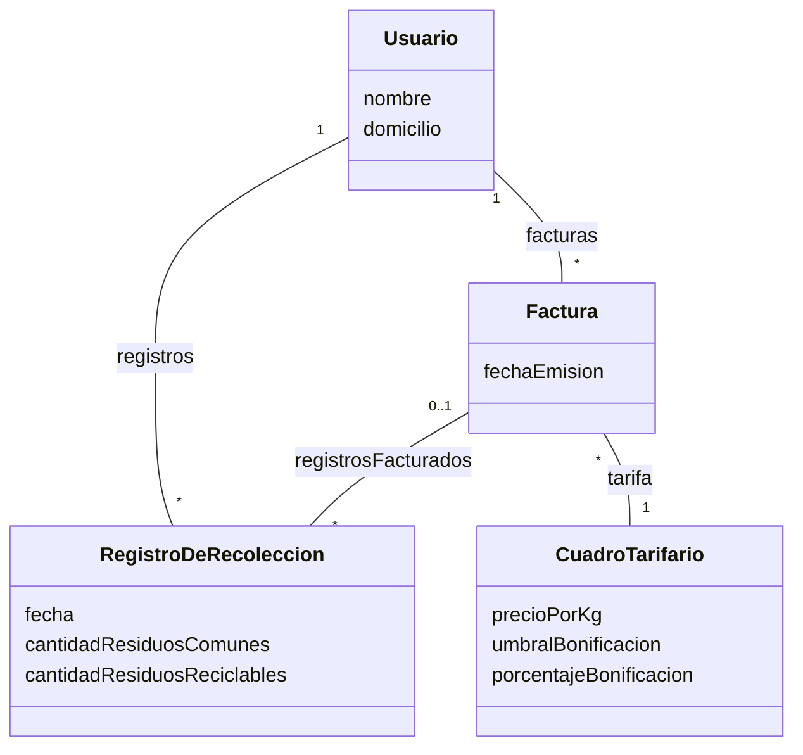

## Ejercicio 5: Servicio de recolección de residuos

Una empresa encargada de la recolección de residuos desea gestionar el servicio prestado a sus usuarios para emitir las facturas correspondientes.
De cada usuario se conoce su nombre y domicilio. Se considera que cada usuario recibe el servicio en un único domicilio, donde se registra periódicamente los residuos retirados. Por cada usuario se registra la cantidad de residuos comunes y la cantidad de residuos reciclables, ambas cantidades expresadas en kg. 

La empresa cuenta con un cuadro tarifario que establece el precio por kilogramo de residuos comunes recolectados: este precio puede ser actualizado periódicamente, por ejemplo, ante cambios en los costos del servicio. Los residuos reciclables no generan costo adicional, y su cantidad se utiliza para determinar si corresponde aplicar una bonificación.
Para emitir la factura de un usuario se tiene en cuenta todos los registros de recolección de un mes. La factura debe contener:
    - El usuario a quien corresponde
    - La fecha de emisión
    - La bonificación aplicada, si corresponde
    - Los registros facturados
    - El monto final que debe pagar
    - El costo del servicio se calcula multiplicando la cantidad de residuos comunes por el precio por kilogramo establecido en el cuadro tarifario.
    - Para determinar si corresponde una bonificación, se calcula el índice de separación de residuos, dividiendo la cantidad de residuos reciclables por la cantidad total de residuos recolectados:

Si el índice de separación de los registros facturados es mayor que 0,30, el usuario recibe una bonificación del 10 % sobre el costo del servicio.
Tareas
Realice una lista de conceptos candidatos.
Grafique el modelo de dominio utilizando UML.
Actualice el modelo de dominio incorporando los atributos correspondientes a cada concepto.
Agregue las asociaciones entre conceptos, indicando la navegabilidad, cardinalidad, nombres de rol, según sea necesario. 

## Conceptos candidatos

frases nominales: empresa, recolección de residuos, servicio, usuarios, facturas, nombre, domicilio, residuos retirados, residuos comunes, cantidad de residuos comunes, residuos reciclables, cantidad de residuos reciclables, cuadro tarifario, precio por kilogramo, costos del servicio, bonificacion, factura, registro de recolección, fecha de emision, monto final, costo del servicio, indice de separacion de residuos

conceptos candidatos:
Objeto físico/tangible:        
Especificación de una cosa:    cuadro tarifario
Lugar:
Transacción:    
Rol de gente:    usuario
Contenedor de cosas:
Cosas en un contenedor:
Otros sistemas:    
Reglas y políticas: 
Registros financieros/laborales: factura, registro de recoleccion

| Tipo 	| Nombre	|
|-|-|
|	C	|	Usuario	|
|	A	|	nombre	|
|	A	|	domicilio	|
|	C	|	RegistroRecoleccion	|
|	A	|	cantidadResiduosComunes	|
|	A	|	cantidadResiduosReciclables	|
|	A	|	fecha	|
|	C	|	CuadroTarifario	|
|	A	|	precioPorKg	|
|   A   |   umbralBonificacion |
|   A   |   porcentajeBonificacion |
|	C	|	Factura	|
|	A	|	fechaEmision	|
|	A	|	montoFinal	|
|	A	|	costo	|

Asociaciones: 
	
    Usuario "1" -- "*" RegistroRecoleccion, A es dueño de B
    
    Usuario "1" -- "*" Factura, A es dueño de B
    
    RegistroRecoleccion "*" -- "0..1" Factura : registrosFacturados, A está registrado/contenido en B

    Factura "1" -- "*" CuadroTarifario, A usa o gestiona B

## Diagrama UML

