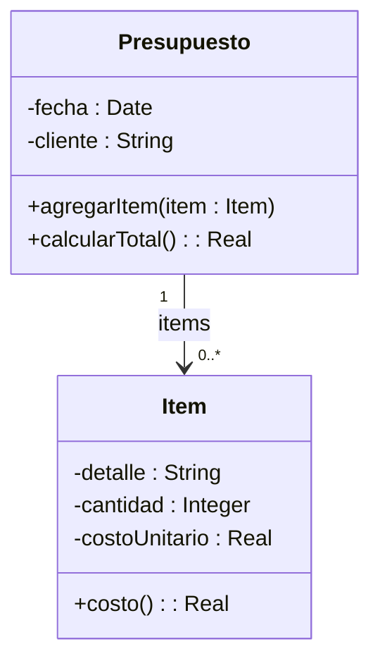

Ejercicio 6: Presupuestos 
Un presupuesto se utiliza para detallar los precios de un conjunto de productos que se desean adquirir. Se realiza para una fecha específica y es solicitado por un cliente, proporcionando una visión de los costos asociados.

El siguiente diagrama muestra un diseño para este dominio. 




Tareas:

a) Implemente:

Defina el proyecto “Presupuesto” y dentro de él implemente las clases que se observan en el diagrama. Ambas son subclases de Object. 

b) Discuta y reflexione

Preste atención a los siguientes aspectos:
- ¿Cuáles son las variables de instancia de cada clase?
Las indicadas en el diagrama UML, agregando en ```Presupuesto``` la variable ```items``` que contiene la lista.

- ¿Qué variables inicializa? ¿De qué formas se puede realizar esta inicialización?
```items``` y ```fecha``` se pueden inicializar en el constructor o en la declaración.

- ¿Qué ventajas y desventajas encuentra en cada una de ellas?


c)Probando su código: 

Utilice los tests provistos  para confirmar que su implementación ofrece la funcionalidad esperada. En este caso, se trata de dos clases: ItemTest y PresupuestoTest, que debe agregar dentro del paquete tests. Haga las modificaciones necesarias para que el proyecto no tenga errores. Siéntase libre de explorar las clases de test para intentar entender qué es lo que hacen.  
