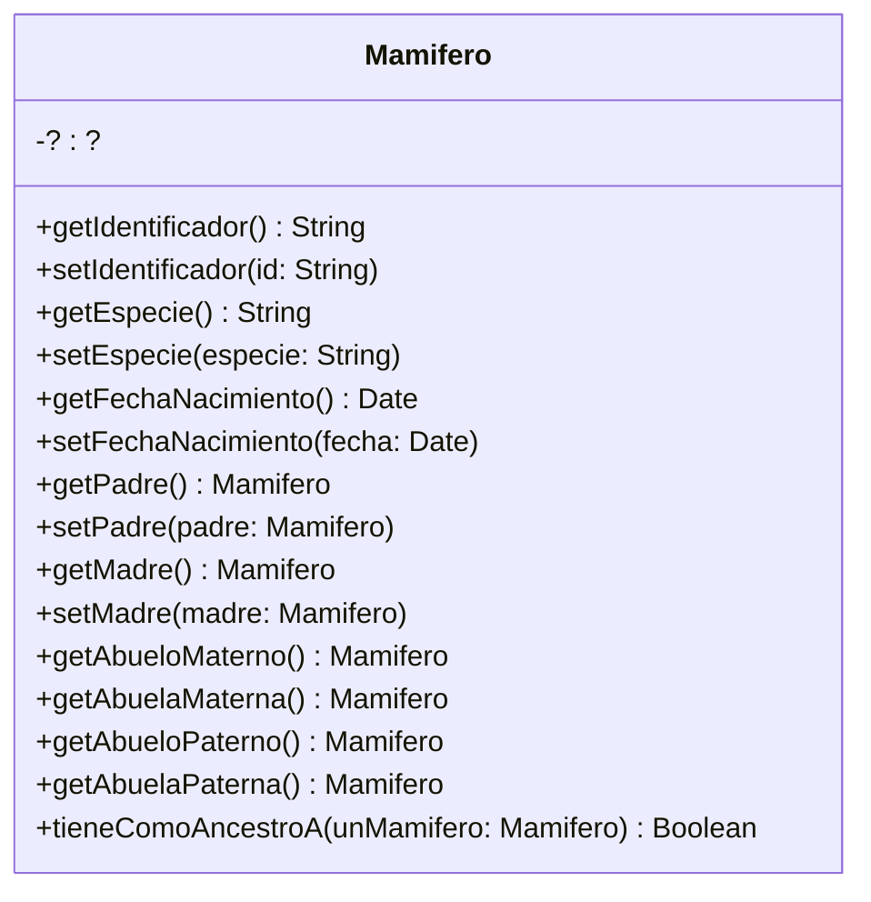
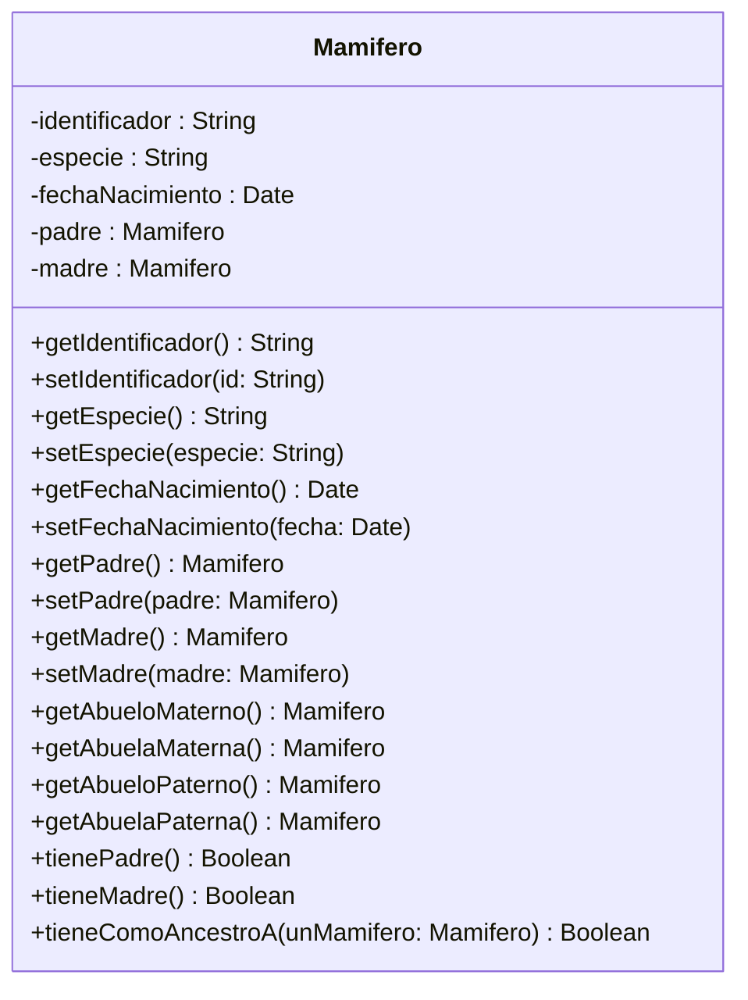
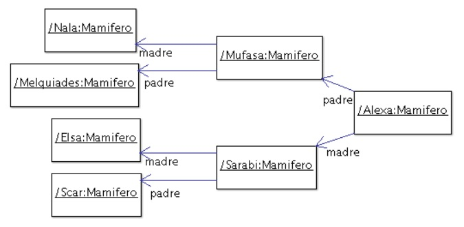

## Ejercicio 9: Genealogía salvaje
En una reserva de vida salvaje (como la estación de cría ECAS, en el camino Centenario), los cuidadores quieren llevar registro detallado de los animales que cuidan y sus familias. Para ello nos han pedido ayuda. Debemos:
### Tareas:
#### a) Complete el diseño e implemente

Modelar una solución en objetos e implementar la clase Mamífero (como subclase de Object). El siguiente diagrama de clases (incompleto) nos da una idea de los mensajes que un mamífero entiende.
Proponga una solución para el método tieneComoAncestroA(...) y deje la implementación para el final y discuta su solución con el ayudante.

Complete el diagrama de clases para reflejar los atributos y relaciones requeridas en su solución.

#### b) Pruebas automatizadas
Siguiendo los ejemplos de ejercicios anteriores, ejecute las pruebas automatizadas provistas. En este caso, se trata de una clase, MamiferoTest, que debe agregar dentro del paquete tests. En esta clase se trabaja con la familia mostrada en la siguiente figura.

En el diagrama se puede apreciar el nombre/identificador de cada uno de ellos (por ejemplo Nala, Mufasa, Alexa, etc).
Haga las modificaciones necesarias para que el proyecto no tenga errores.  Si algún test no pasa, consulte al ayudante. 
