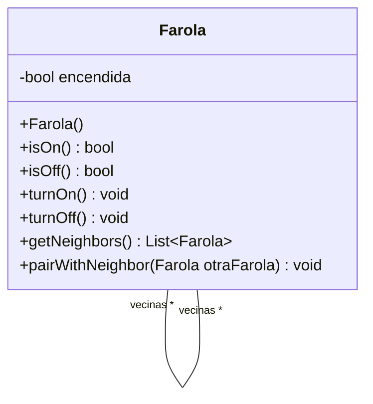

## Ejercicio 10: Red de Alumbrado
Imagine una red de alumbrado donde cada farola está conectada a una o varias vecinas formando un grafo conexo. Cada una de las farolas tiene un interruptor. Es suficiente con encender o apagar una farola cualquiera para que se enciendan o apaguen todas las demás. Sin embargo, si se intenta apagar una farola apagada (o si se intenta encender una farola encendida) no habrá ningún efecto, ya que no se propagará esta acción hacia las vecinas.
La funcionalidad a proveer permite:
crear farolas (inicialmente están apagadas)
conectar farolas a tantas vecinas como uno quiera (las conexiones son bi-direccionales) 
encender una farola (y obtener el efecto antes descrito)
apagar una farola (y obtener el efecto antes descrito)
### Tareas:
#### a) Modele e implemente

1. Realice el diagrama UML de clases de la solución al problema.



2. Implemente en Java, la clase Farola, como subclase de Object, con los siguientes métodos:
```java
/*
* Crear una farola. Debe inicializarla como apagada
*/
public Farola ()


/*
* Crea la relación de vecinos entre las farolas. La relación de vecinos entre las farolas es recíproca, es decir el receptor del mensaje será vecino de otraFarola, al igual que otraFarola también se convertirá en vecina del receptor del mensaje
*/
public void pairWithNeighbor( Farola otraFarola )

/*
* Retorna sus farolas vecinas
*/
public List<Farola> getNeighbors ()


/*
* Si la farola no está encendida, la enciende y propaga la acción.
*/
public void turnOn()

/*
* Si la farola no está apagada, la apaga y propaga la acción.
*/
public void turnOff()

/*
* Retorna true si la farola está encendida.
*/
public boolean isOn()

/*
* Retorna true si la farola está apagada.
*/
public boolean isOff()
```

#### b) Verifique su solución con las pruebas automatizadas 
Utilice los tests provistos por la cátedra para probar las implementaciones del punto 2.
