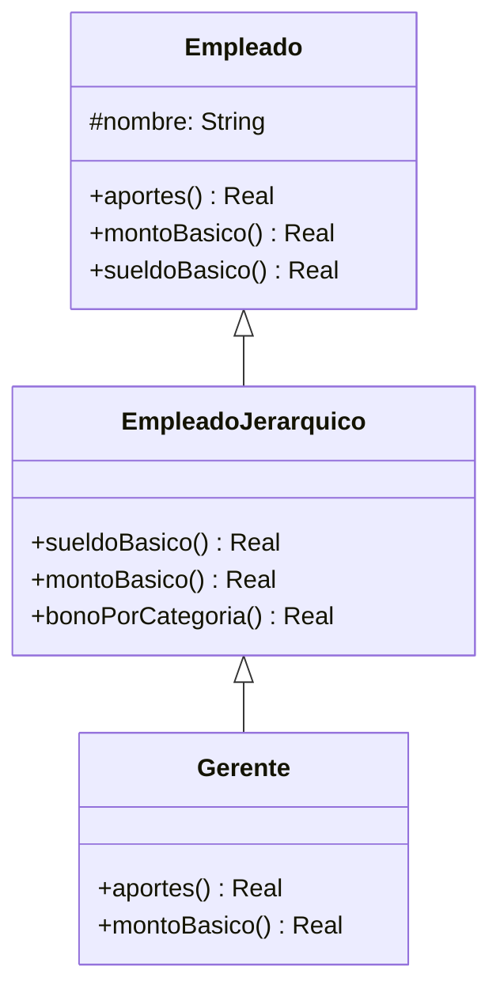

## Ejercicio 11: Method lookup con Empleados
Sea la jerarquía de Empleado como muestra la figura de la izquierda, cuya implementación de referencia se incluye en la tabla de la derecha.


<table>
<tr>
<th>Empleado</th>
<th>EmpleadoJerarquico</th>
<th>Gerente</th>
</tr>
<tr>
<td valign="top">

```java
    public double montoBasico() {
        return 35000;
    }
```
```java
    public double aportes() {
        return 13500;
    }
```
```java
    public double sueldoBasico() {
        return this.montoBasico() + this.aportes();
    }
```

</td>
<td valign="top">

```java
public double sueldoBasico() {
        return super.sueldoBasico() + this.bonoPorCategoria();
    }
```
```java
    public double montoBasico() {
        return 45000;
    }
```
```java
    public double bonoPorCategoria() {
        return 8000;
    }
```

</td>
<td valign="top">

```java
    public double aportes() {
        return this.montoBasico() * 0.05d;
    }
```
```java
    public double montoBasico() {
        return 57000;
    }
```

</td>
</tr>
</table>


Analice cada uno de los siguientes fragmentos de código y resuelva las tareas indicadas abajo:

```java
Gerente alan = new Gerente("Alan Turing");
double aportesDeAlan = alan.aportes();
```

```java
Gerente alan = new Gerente("Alan Turing");
double sueldoBasicoDeAlan = alan.sueldoBasico();
```


### Tareas:
1. Liste todos los métodos, indicando nombre y clase, que son ejecutados como resultado del envío del último mensaje de cada fragmento de código (por ejemplo, (1) método +aportes de la clase Empleado, (2) ...)

```java
Gerente alan = new Gerente("Alan Turing");
double aportesDeAlan = alan.aportes();
```

- (1) aportes() de la clase Gerente
- (2) montoBasico() de la clase Gerente

```java
Gerente alan = new Gerente("Alan Turing");
double sueldoBasicoDeAlan = alan.sueldoBasico();
```

- (1) sueldoBasico() de la clase EmpleadoJerarquico
- (2) sueldoBasico() de la clase Empleado
- (3) montoBasico() de la clase Gerente 
- (4) aportes() de la clase Gerente
- (5) montoBasico() de la clase Gerente
- (6) bonoPorCategoria() de la clase EmpleadoJerarquico

2. ¿Qué valores tendrán las variables aportesDeAlan y sueldoBasicoDeAlan luego de ejecutar cada fragmento de código?

aportesDeAlan = 57000 * 0.05 = 2850

sueldoBasicoDeAlan = 57000 + 2850 + 8000 = 67850


